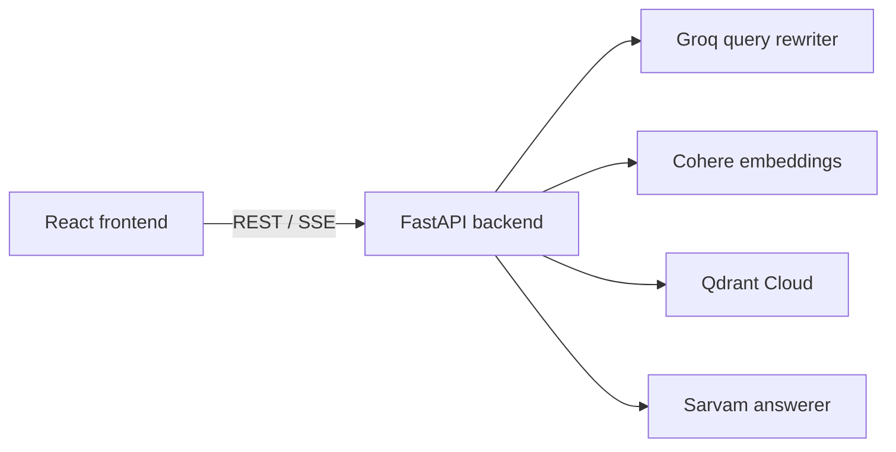

# ParAILegal

ParAILegal is an AI-powered Indian legal research tool. Ask a question about Indian law and get a grounded answer with clickable citations, traced back to primary sources: the Constitution of India, the BNS 2023, BNSS 2023, BSA 2023, and landmark Supreme Court judgments.

> This is a research tool, not legal advice. Verify every provision against the official Gazette and consult a qualified advocate for legal advice.

## Repository Layout

```text
backend/    FastAPI RAG API — routing, query rewriting, Qdrant retrieval, grounded answers
frontend/   React + TypeScript + Vite web app — streaming answers, citations, sources panel
```



## Quick Start

You need Python 3.10+, Node.js, API keys for Sarvam, Groq, and Cohere, and a Qdrant instance.

**1. Backend** — see [backend/README.md](backend/README.md) for configuration, corpus data, and ingestion.

```powershell
cd backend
python -m venv .venv
.\.venv\Scripts\Activate.ps1
python -m pip install -r requirements.txt
# create backend/.env with your API keys
python -m uvicorn app.main:app --reload
```

The API runs at `http://127.0.0.1:8000` (docs at `/docs`).

**2. Frontend** — see [frontend/README.md](frontend/README.md).

```powershell
cd frontend
npm install
# optional: frontend/.env.local with VITE_API_BASE_URL (defaults to http://localhost:8000)
npm run dev
```

The app runs at `http://localhost:5173`.

## License

GNU Affero General Public License v3.0 — see [LICENCE.md](LICENCE.md).
