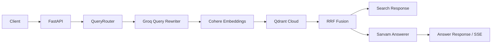

# ParAILegal — Backend

The FastAPI backend for [ParAILegal](../README.md). It is an Indian legal research API. It retrieves relevant passages from the Constitution of India, the BNS, BNSS, BSA, and landmark judgments, then uses a language model to produce a grounded answer with source citations.

The project is a FastAPI service backed by Qdrant Cloud. Queries are routed by legal domain, rewritten for retrieval, embedded with Cohere, searched with Qdrant, fused with reciprocal rank fusion, and optionally answered by Sarvam.

> This is a research tool, not legal advice. Verify every provision against the official Gazette and consult a qualified advocate for legal advice.

## Features

- Semantic search over constitutional provisions, statutes, and judgments
- Automatic routing to `constitution`, `statutes`, `judgements`, or `all`
- Query rewriting through Groq using a domain-specific prompt
- Asymmetric Cohere embeddings: documents use `search_document`, queries use `search_query`
- Qdrant vector storage with one collection and `source_type` payload filtering
- RRF fusion of original and rewritten query results
- Grounded legal answers through Sarvam with citation-oriented prompting
- Blocking JSON answers and Server-Sent Events (SSE) streaming answers
- Readiness checks and index statistics for deployment monitoring

## Architecture



At startup, the lifespan handler verifies the cloud APIs and checks each Qdrant-backed index. If a corpus is missing from Qdrant, it loads the corresponding local JSONL files, embeds the chunks, and uploads them. Existing vectors are reused on later starts.

## Repository Layout

All paths are relative to `backend/`, and every command below is run from `backend/`.

```text
app/
  main.py                         FastAPI application and health endpoints
  api/routes/                     Search, answer, and admin routes
  schemas/                        Pydantic request and response models
  core/                            Settings, lifecycle, and logging
  services/
    rag_services.py               RAG orchestration
    routing_service.py            Legal domain classification
    retrieval/                    Index lifecycle, retrieval, and RRF fusion
  infrastructure/
    llm/                           Cohere, Groq, and Sarvam integrations
    qdrant/                        Qdrant vector-store wrapper
    loaders/                       JSONL corpus loaders
data/                              Local JSONL corpora (ignored by Git)
ingest.py                          Explicit corpus ingestion utility
tests/test_suite.py                HTTP and router test suite
qdrant_test.py                     Qdrant payload-index maintenance utility
qdrantPayload.py                   Qdrant source-type count utility
requirements.txt                   Python dependencies
```

The active vector backend is Qdrant. The `app/infrastructure/faiss/` module is retained as legacy code and is not used by the current RAG wiring.

## Requirements

- Python 3.10 or newer
- A Qdrant Cloud project or self-hosted Qdrant instance
- API keys for Sarvam, Groq, and Cohere
- The JSONL corpus files listed below

Install the runtime and test dependencies in a virtual environment:

```powershell
cd backend
python -m venv .venv
.\.venv\Scripts\Activate.ps1
python -m pip install --upgrade pip
python -m pip install -r requirements.txt
```

## Configuration

Create a `.env` file in `backend/`. It is intentionally ignored by Git.

```dotenv
SARVAM_API_KEY=your-sarvam-api-key
SARVAM_MODEL=sarvam-105b

GROQ_API_KEY=your-groq-api-key
GROQ_MODEL=llama-3.1-8b-instant

COHERE_API_KEY=your-cohere-api-key
COHERE_EMBED_MODEL=embed-multilingual-v3.0
COHERE_RERANK_MODEL=rerank-multilingual-v3.0

QDRANT_URL=https://your-qdrant-endpoint
QDRANT_API_KEY=your-qdrant-api-key
QDRANT_COLLECTION=ParAILegal
```

Optional retrieval and retry settings have defaults in `app/core/config.py`:

| Setting | Default | Purpose |
| --- | ---: | --- |
| `TOP_K_SEARCH` | `15` | Maximum retrieved results before answer truncation |
| `TOP_K_ANSWER` | `5` | Sources supplied to answer generation |
| `TEMPERATURE_REWRITE` | `0.1` | Groq rewrite temperature |
| `TEMPERATURE_ANSWER` | `0.2` | Sarvam answer temperature |
| `MIN_SCORE_THRESHOLD` | `0.1` | Minimum retrieval score setting |
| `BATCH_SIZE` | `32` | Embedding batch size |
| `MAX_RETRIES` | `3` | Query-rewriter retry count |
| `RETRY_DELAY` | `1.0` | Delay between retries in seconds |

## Corpus Data

Place these files under `backend/data/`:

```text
data/constitution_final.jsonl
data/bns_clean.jsonl
data/bnss_clean.jsonl
data/bsa_clean.jsonl
data/landmarks.jsonl
```

The Constitution, statute, and judgment loaders normalize each JSONL record into searchable text plus metadata. Constitution citations are synthesized from article, title, and part fields when the source record does not provide one.

The `data/` directory is ignored by Git. Obtain and manage corpus files separately, and do not commit sensitive or licensed source material to this repository.

## Ingesting Data

Use the ingestion script when populating a new Qdrant collection or deliberately rebuilding a corpus:

```powershell
python ingest.py
python ingest.py --corpus constitution
python ingest.py --corpus statutes
python ingest.py --corpus judgements
python ingest.py --force
```

`--force` re-embeds and uploads an existing corpus. Ingestion can be slow and subject to provider rate limits. Qdrant persists the uploaded vectors, so normal application startup skips ingestion when the relevant vectors already exist.

The helper scripts are operational utilities, not part of the API startup path:

```powershell
python qdrantPayload.py    # Count source types in the configured collection
python qdrant_test.py      # Recreate the source_type payload index and count values
```

## Running the API

From `backend/`, start the development server:

```powershell
python -m uvicorn app.main:app --reload
```

The API is available at `http://127.0.0.1:8000`. Interactive OpenAPI documentation is available at `/docs`, and the generated schema is at `/openapi.json`.

Startup may take time on a new Qdrant collection because the application embeds and uploads missing corpora. Check readiness before using search or answer routes.

## API Endpoints

### Health and readiness

```http
GET /health
GET /ready
```

`/health` returns `{"status":"ok"}`. `/ready` returns `starting` during initialization, then `ready` with index counts. Routes that need the RAG system return HTTP 503 until the application is ready.

### Search

```http
POST /api/v1/search
Content-Type: application/json

{
  "query": "What does Article 21 of the Constitution guarantee?",
  "k": 10,
  "domain": "constitution"
}
```

`query` must contain 3 to 2,000 characters. `k` ranges from 1 to 50. `domain` is optional and accepts `constitution`, `statutes`, `judgements`, or `all`.

### Full answer

```http
POST /api/v1/answer
Content-Type: application/json

{
  "query": "When can police arrest a person without a warrant?",
  "domain": "statutes"
}
```

The response includes the original query, detected domain, grounded answer, and the source chunks used to generate it. Answer queries accept 3 to 4,000 characters.

Two prefixes select answer modes:

- `ADVOCATE:` asks for the strongest counter-argument supported by the retrieved context.
- `SUMMARISE:` asks for a plain-language explanation suitable for a client.

### Streaming answer

```http
POST /api/v1/answer/stream
Content-Type: application/json

{
  "query": "What is the punishment for murder under BNS?"
}
```

The endpoint returns `text/event-stream`. Events include `sources`, individual `token` values, a final `done` event containing the complete answer, or an `error` event. A `: ping` SSE comment is sent periodically to keep long-running connections alive.

### Admin statistics

```http
GET /api/v1/admin/stats
```

Returns the current index counts and whether the cloud models passed startup checks. This endpoint currently has no authentication layer; place the service behind appropriate access control before exposing it publicly.

## Testing

The HTTP-oriented tests expect a running server whose `/ready` endpoint returns HTTP 200. Start the API in one terminal, then run one of the following in another:

```powershell
python -m tests.test_suite --router
python -m tests.test_suite --retrieval-only
python -m tests.test_suite --category statutes
python -m tests.test_suite --id S01
python -m tests.test_suite
```

For a different server URL:

```powershell
python -m tests.test_suite --base-url http://192.168.1.10:8000
```

The base URL can also be supplied with `PARALEGAL_TEST_URL`. With pytest:

```powershell
pytest tests/test_suite.py -v
pytest tests/test_suite.py -v -m "not slow"
```

The full answer tests call external services and can be slow or rate-limited. The router mode is local and does not initialize cloud models.

## Operational Notes

- Cloud API credentials are required during application startup, even when only checking the health endpoint.
- Search and answer requests are unavailable until model checks and Qdrant index initialization complete.
- The Cohere trial tier limits embedding volume; avoid unnecessary `--force` ingestion.
- CORS is currently configured to allow all origins. Restrict `allow_origins` before production deployment.
- The API has no authentication or authorization middleware in the current codebase.
- Answers are designed to stay grounded in retrieved context, but application users must independently verify legal accuracy and currency
